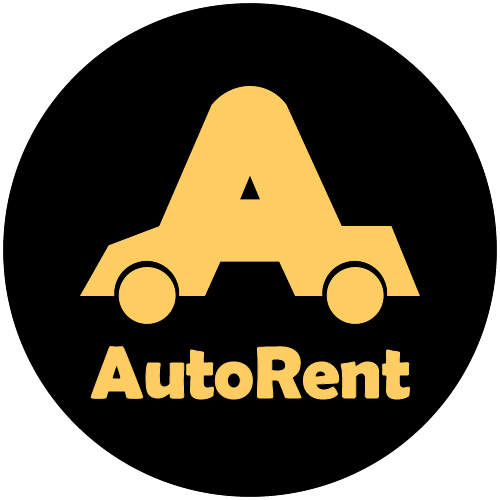

    

<h1 align='center'>AutoRent</h1>
  

    <a href="http://vechicle-rental-backend.vercel.app/">View Demo Backend</a>
    ·
    <a href="https://github.com/collab2/vechicle-rental-backend/issues">Report Bug</a>
    ·
    <a href="https://github.com/collab2/vechicle-rental-backend/pulls">Request Feature</a>
  

## About The Project

 

 <strong>AutoRent</strong> is a website that provides vehicle rental services in various major cities in Indonesia. It has features such as users can rent the desired vehicle, search for vehicles based on certain categories, order history, admin can add vehicles, change vehicles, and users can update personal data.
 

## Built With

- [Node.js](https://nodejs.org/en/)
- [ExpressJS](https://expressjs.com/)
- [Supabase](https://supabase.io/)
- [JSON Web Token](https://jwt.io/)
- [Midtrans](https://midtrans.com/)
- [Cloudinary](https://cloudinary.com/)
- [Redis](https://redis.io/)
- [Nodemailer](https://nodemailer.com/about/)
- [Multer](https://www.npmjs.com/package/multer)
- [Morgan](https://www.npmjs.com/package/morgan)
- [Bcrypt](https://www.npmjs.com/package/bcrypt)
- [Nodemailer](https://nodemailer.com/about/)
- [Mustache](https://www.npmjs.com/package/mustache)
- [Googleapis](https://www.npmjs.com/package/googleapis)
- and other packages see file `package.json`

## Requirements

1. <a href="https://nodejs.org/en/download/">Node Js</a>
2. Node_modules `npm install` or `yarn install` or `pnpm install`
3. Backend API AutoRent [`here`](https://github.com/collab2/vechicle-rental-backend)
4. Postman [`here`](https://www.postman.com/downloads/)

## Getting Started

1. Download these repos [`Backend`](https://github.com/collab2/vechicle-rental-backend) and [`Frontend`](https://github.com/collab2/Vechicle-rental-frontend) or you can type `git clone`[`Backend`](https://github.com/collab2/vechicle-rental-backend) and [`Frontend`](https://github.com/collab2/Vechicle-rental-frontend)
2. Open app's directory in CMD or Terminal
3. Type `npm install` or `yarn install` or `pnpm install`
4. Add .env file at root folder project see file `.env.example`
5. Type `npm start` or `yarn start` or `pnpm start` for run this app.
6. For Testing: Postman Documentation [`here`](https://documenter.getpostman.com/view/15191012/2s8YYMnLCa)

## Acknowledgements

- [Node.js](https://nodejs.org/en/)
- [ExpressJS](https://expressjs.com/)
- [Supabase](https://supabase.io/)
- [ExpressJS](https://expressjs.com/)
- [Supabase](https://supabase.io/)
- [Midtrans](https://midtrans.com/)
- [Cloudinary](https://cloudinary.com/)
- [Redis](https://redis.io/)
- [Nodemailer](https://nodemailer.com/about/)
- [Multer](https://www.npmjs.com/package/multer)
- [Morgan](https://www.npmjs.com/package/morgan)
- [Bcrypt](https://www.npmjs.com/package/bcrypt)
- [Nodemailer](https://nodemailer.com/about/)
- [Mustache](https://www.npmjs.com/package/mustache)
- [Googleapis](https://www.npmjs.com/package/googleapis)
- and other packages see file `package.json`

## Team

> All Members of AutoRent Team

| <a href="#" target="_blank">**Full-Stack Developer & Team Leader**</a> | <a href="#" target="_blank">**Full-stack Developer**</a> | <a href="#" target="_blank">**Back-End Developer**</a> | <a href="#" target="_blank">**Front-End Developer**</a> | <a href="#" target="_blank">**Front-End Developer**</a> | <a href="#" target="_blank">**Front-End Developer**</a> | <a href="#" target="_blank">**Front-End Developer**</a> | <a href="#" target="_blank">**Front-End Developer**</a> |
| :-: | :-: | :-: | :-: | :-: | :-: | :-: | :-: |
|  |  |  | [)](https://github.com/IrfanAlfiansyah) | [)](https://github.com/Fhmi00) |  |  |  |
| <a href="https://github.com/collab2/Vehicle-rental-frontend" target="_blank">`https://github.com/setyawandwiki`</a> | <a href="https://github.com/mabdullah12101" target="_blank">`https://github.com/mabdullah12101`</a> | <a href="https://github.com/graciasvito/vechicle-rental-backend" target="_blank">`https://github.com/graciasvito/vechicle-rental-backend`</a> | <a href="https://github.com/IrfanAlfiansyah/Vehicle-rental-frontend" target="_blank">`https://github.com/IrfanAlfiansyah/Vehicle-rental-frontend`</a> | <a href="https://github.com/Fhmi00/Vehicle-rental-frontend" target="_blank">`https://github.com/Fhmi00/Vehicle-rental-frontend`</a> | <a href="https://github.com/KevinReyhanW/Vehicle-rental-frontend" target="_blank">`https://github.com/KevinReyhanW/Vehicle-rental-frontend`</a> | <a href="https://github.com/azkar-sh/Vehicle-rental-frontend" target="_blank">`https://github.com/azkar-sh/Vehicle-rental-frontend`</a> | <a href="https://github.com/vvahyudi/Vehicle-rental-frontend" target="_blank">`https://github.com/vvahyudi/Vehicle-rental-frontend`</a> |

---

 

## Related Project

- <a href="https://github.com/collab2/Vehicle-rental-frontend" target="_blank">AutoRent Frontend</a>
- <a href="https://github.com/collab2/vechicle-rental-backend" target="_blank">AutoRent Backend</a>
